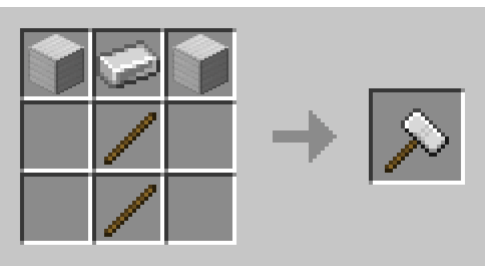
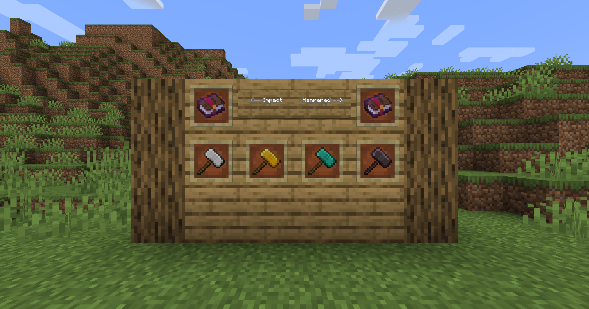

# Hammered

Adds hammers to the game that can be used like swords, pickaxes, axes, shovels and hoes!

This mod adds:
- 4 Hammers
- 2 Enchantments

Recipes

Impact Enchantment

When falling and hitting a mob, gives the mob extra knockback up.

Levels: **2**

***Can be obtained from librarian villagers***

Hammered Enchantment

Mines an extra area around you.

Levels: **3**

Area based on level:
- Level 1: 3x3x1
- Level 2: 3x3x2
- Level 3: 3x3x3

***Can be disabled by sneaking***

***Can be obtained from librarian villagers***

